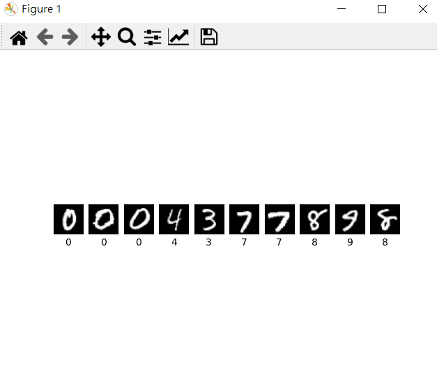

# Lenet-by-keras
## About
Use Keras to build Lenet and train LeNet on MNIST
## Python version
3.7
## UI
Using PyQt to make UI

## Function
### Show Train Image
Randomly show 10 images and labels in MNIST training dataset

### Show Hyperparameters
Print out training hyperparameters (batch size, learning rate, optimizer). 

### Train 1 epoch 
Train 1 epoch from initial status and show training loss at the end of the epoch

### Inference
Load model which is trained by 15 epoch, choose one image from MNIST test images, inference the image, show image and estimate the image as following
